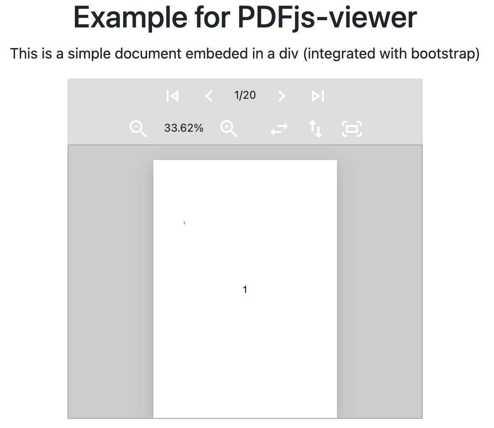

# PDFjs-viewer

The distribution of [Mozilla's PDF.js](https://mozilla.github.io/pdf.js/) includes an example of a viewer that can be used in a web page by means of inserting using an `iframe`. But the viewer cannot be easily used or customized for using it as part of a web application.

PDFjs-viewer is a embeddable and easily customizable PDF viewer that is implemented using the PDF.js library. 

So, if you have a `div` in your web application, you can convert it in a PDF viewer as in the next example:

```html
<div class="pdfjs-viewer">
</div> 
<script>
let pdfViewer = new PDFjsViewer($('.pdfjs-viewer'));
pdfViewer.loadDocument("https://github.com/dealfonso/pdfjs-viewer/raw/main/examples/test.pdf");
</script>
```

The PDFjsViewer is customizable and has different options and callbacks that enable it to be easily integrated in your application.

Some examples included in the distribution:
- A simple PDF viewer, for a simple document.
- A PDF viewer with a toolbar that enables to navigate through the document.
- A PDF viewer with thumbnails that interact with the main document.
- A PDF viewer in which is is possible to create selections and move them accross different pages.

**DISCLAIMER:** _PDFjs-viewer is written from scratch and has nothing to do with the example viewer in the PDF.js distribution._

## Is PDFjs-viewer for me?

Well, if you need a PDF viewer in your web application, you can try to embed the viewer that comes in the [PDF.js distribution](https://github.com/mozilla/pdf.js) in an `iframe`. It is well supported and has a lot of background.

But if (as in my case) you need more than simply a PDF viewer embedded in an `iframe`: you need to draw in the pages of the PDF, need to add more features to your viewer, customize the style, etc., PDFjs-viewer is worth a try. 

> The origin of PDFjs-viewer was to enable drawing a selection over the pages, to add a digital signature with an external application.

### Technical facts

- The pages of each of the document are rendered on demand, to avoid having all the pages using the memory of the browser. The viewer detects the pages which are visible, and renders each of them. Although rendering is fast, using the options (i.e. `extraPagesToLoad`) it is advisable to render some extra pages to enable a better user experience when scrolling the document.
- PDFjs-viewer adds some callbacks that are called upon different events: `onDocumentReady`, `onNewPage`, `onPageRender`, `onZoomChange`, `onActivePageChanged`. Each callback is binded to the PDFjsViewer instance, so it is possible to use `this` to refer to it.
- PDFjs-viewer renders the pages according to the size of the DIVs in which they are included. In this way, the amount of memory is adjusted to the minimum needed. It is important that the `PDFjsViewer` considers the `pixel_ratio` feature to increase the resolution of the images according to the features of the device in which the document has been opened (e.g. retina displays and so on).
- PDFjs-viewer includes support for zooming the pages, so that the user does not need to deal with this typical feature.

## Using

### Dependencies
PDFjs-viewer depends on Mozilla's [PDF.js library](https://mozilla.github.io/pdf.js) and [jQuery](https://jquery.com). So please be sure to include the dependency in your project:

```html
<script src="https://cdnjs.cloudflare.com/ajax/libs/jquery/3.6.0/jquery.min.js"></script>
<script src="https://cdnjs.cloudflare.com/ajax/libs/pdf.js/2.11.338/pdf.min.js"></script>
<script>
var pdfjsLib = window['pdfjs-dist/build/pdf'];
pdfjsLib.GlobalWorkerOptions.workerSrc = 'https://cdnjs.cloudflare.com/ajax/libs/pdf.js/2.11.338/pdf.worker.min.js';
</script>
```

### From source

There is a single _javascript_ file that contain the whole PDFjsViewer class (in folder `js`).

There are also a set of _css_ files that contain some styles to be used in the library and the examples. These files can also be included individually in your project, or combined into a single file by concatenating them.

A `Makefile` is provided to create the single all-in-one minified `js` and `css` files for the library.

```console
# npm install -g uglify-js clean-css-cli
...
# git clone https://github.com/dealfonso/pdfjs-viewer
# cd pdfjs-viewer
# make
uglifyjs js/*.js  -b | cat notice - > pdfjs-viewer.js
uglifyjs js/*.js  | cat notice.min - > pdfjs-viewer.min.js
cleancss css/*.css --format beautify | cat notice - > pdfjs-viewer.css
cleancss css/*.css | cat notice.min - > pdfjs-viewer.min.css
```

Now you can use files `pdfjs-viewer.min.js` and `pdfjs-viewer.min.css` in your project (jQuery is a prerrequisite):

```html
<script src="https://cdnjs.cloudflare.com/ajax/libs/jquery/3.6.0/jquery.min.js"></script>
<script src="pdfjs-viewer.min.js"></script>
<link rel="stylesheet" href="pdfjs-viewer.min.css">
```

### From a CDN

It is possible to use `pdfjs-viewer` directly from a CDN:

```html
<script src="https://cdnjs.cloudflare.com/ajax/libs/jquery/3.6.0/jquery.min.js"></script>
<script src="https://cdn.jsdelivr.net/gh/dealfonso/pdfjs-viewer@1.0.0/pdfjs-viewer.min.js"></script>
<link rel="stylesheet" href="https://cdn.jsdelivr.net/gh/jsutilslib/pdfjs-viewer@1.0.0/pdfjs-viewer.min.css">
```

## API

The creation of a PDF viewer consists in creating a `PDFjsViewer` object, setting the jQuery object in which the PDF viewer should be set, and configuring the options that we may need.

```javascript
var options = { 
    ...
};
var pdfViewer = new PDFjsViewer($('.pdfjs-viewer'), options);
```

### Options

The possible option values along with the default values are the next (the comments in the code are self-explanatory):
```javascript
// Fraction of the area of the page that has to be visible to be considered that it is visible
visibleThreshold: 0.5,
// Number of pages to load appart from the currently visible one (to enable fast scrolling)
extraPagesToLoad: 3,
// The class used for each page (the div that wraps the content of the page)
pageClass: "pdfpage",
// The class used for the content of each page (the div that contains the page)
contentClass: "content-wrapper",
// Posible zoom values to iterate over using "in" and "out"
zoomValues: [ 0.25, 0.5, 0.75, 1, 1.25, 1.50, 2, 4, 8 ],
// Percentage of the container that will be filled with the page
zoomFillArea: 0.95,
// Function called when a document has been loaded and its structure has been created
onDocumentReady: () => {},
// Function called when a new page is created (it is binded to the object, and receives a jQuery object as parameter)
onNewPage: (page, i) => {},
// Function called when a page is rendered
onPageRender: (page, i) => {},
// Function called when the zoom level changes (it receives the zoom level)
onZoomChange: (zoomlevel) => {},
// Function called whenever the active page is changed (the active page is the one that is shown in the viewer)
onActivePageChanged: (page, i) => {},
// Function called to get the content of an empty page
emptyContent: () => $('<div class="loader"></div>')
// Function called to obtain a page that shows an error when the document could not be loaded (returns a jQuery object)
errorPage: () => {
    $(`<div class="placeholder"></div>`).addClass(this.settings.pageClass).append($(`<p class="m-auto"></p>`).text("could not load document"))
},
```

### Methods

The public methods of the PDFViewer class are the next:

- `loadDocument(document)`: Loads the document and returns a promise to load it (and so the result is _thenable_ to add actions after loading the document, or is _catchable_ in case of error). The `document` can be either an _url_ or a _bin array_.
- `forceViewerInitialization()`: Forces the creation (or re-creation) of the whole content of the viewer (i.e. new divs, structures, etc.). It is usefull for full refresh of the viewer (e.g. when changes the rotation of the pages).
- `refreshAll()`: Recalculates which pages are now visible and forces redrawing them.
- `getActivePage()`: Gets the jQuery div object corresponding to the active page (or null, if none of the pages have been set).
- `first()`: Scrolls to the first page of the document.
- `last()`: Scrolls to the last page of the document.
- `next()`: Scrolls to the next page (if any).
- `prev()`: Scrolls to the previous page (if any).
- `getPageCount()`: Gets the number of pages of the document.
- `getPages()`: Retrieves all the pages of the document (the pageinfo structures).
- `scrollToPage(i)`: Sets the scroll position of the container to page number `i`
- `isPageVisible(i)`: Returns true if page number `i` is considered to be visible 
- `setZoom(zoom)`: Sets the current zoom level and applies it to all the pages (it is possible to use a float value which represents a fraction or a keyword 'in', 'out', 'width', 'height' or 'fit').
- `getZoom()`: Obtain the current zoom level
- `rotate(deg, accumulate = false)`: Rotates the pages of the document `deg` degrees (if `accumulate` is set to `false`), or increases the rotation by `deg` degrees (if `accumulate` is set to `true`).

## Examples

### Example 1 - the most simple example

The most simple example is to include a PDF viewer as the whole body of the web application:

```html
<script>
    var pdfViewer = new PDFjsViewer($('body'));
    pdfViewer.loadDocument('test.pdf');
</script>
```

In this example, the whole page will be a PDF viewer showing document _test.pdf_.


Check the example at [PDFjs-viewer example-1](https://codepen.io/dealfonso/pen/QWqMJwp)

### Example 2 - a viewer in a DIV

To create a viewer in a DIV, it is needed to add class `pdfjs-viewer` class to the div.

In this snippet, we are also using some of the callbacks that PDFjs-viewer provides, to update parts of our interface.

```html
<div class="row h-100">
  <div class="col-12 text-center">
    <h1>Example for PDFjs-viewer</h1>
    <p>This is a simple document embeded in a div (integrated with bootstrap)</p>
  </div>
  <div class="row col-6 offset-sm-3 pdfviewer p-0 row h-100">
    <div class="pdftoolbar text-center row m-0 p-0">
        ...
    </div>
    <div class="pdfjs-viewer h-100">
    </div>
  </div>
</div>
<script type="text/javascript">
let pdfViewer = new PDFjsViewer($(".pdfjs-viewer"), {
  onZoomChange: function (zoom) {
    zoom = parseInt(zoom * 10000) / 100;
    $(".zoomval").text(zoom + "%");
  },
  onActivePageChanged: function (page, pageno) {
    $(".pageno").text(pageno + "/" + this.getPageCount());
  }
});
pdfViewer
  .loadDocument(
    "https://cdn.jsdelivr.net/gh/dealfonso/pdfjs-viewer/examples/test.pdf"
  )
  .then(function () {
    pdfViewer.setZoom("fit");
  });
</script>
```



Check the example at [PDFjs-viewer example-2](https://codepen.io/dealfonso/pen/qBPPEEd)

### Example 3 - a document with thumbnails and a toolbar

Each of the PDFjsViewer object is independent one from each other, and so it is possible to include multiple PDF documents in the same web application.

In this example, we have included two independent documents (which at the end, have the same PDF source): one to act as thumbnails and other to act as the main document. Then using the callbacks, it is possible to make them interact one with the other to mark the _active page_ in the thumbnails when scrolling the main document, or showing a specific page when clicking on one of the pages in the thumbnails documents.


Check the example at [PDFjs-viewer example-3](https://codepen.io/dealfonso/pen/dyVVYgP)

## Collaborations

I really appreciate collaborations either by detecting bugs or by suggesting new features for this project. In this case, you can open issues and I'll try to address them in a best-effort basis.

Also I welcome collaborations for enhancing the viewer. So if you can add new features, please fork the project and create pull requests. In this case, please add documentation about the new features both in the documentation as in the pull-request description.
